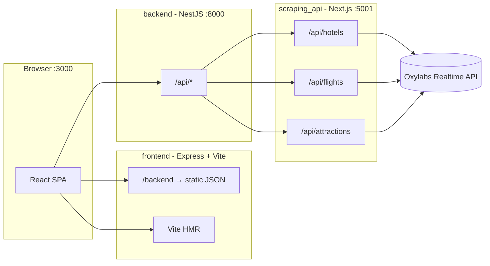

# Getaway Hub (TheDevArchitects) — Project Documentation

> **Product name:** Getaway Hub  
> **Repository:** TheDevArchitects  
> **Last updated:** June 2026  
> **Purpose:** Long-term reference for architecture, APIs, data, frontend pages, and user workflows.

---

## Table of contents

1. [Executive summary](#1-executive-summary)
2. [System architecture](#2-system-architecture)
3. [Repository layout](#3-repository-layout)
4. [Running the project](#4-running-the-project)
5. [Environment variables](#5-environment-variables)
6. [Backend services](#6-backend-services)
7. [API reference](#7-api-reference)
8. [Static data (JSON)](#8-static-data-json)
9. [Frontend application](#9-frontend-application)
10. [Routing and user workflows](#10-routing-and-user-workflows)
11. [Frontend pages (detailed)](#11-frontend-pages-detailed)
12. [Key frontend components](#12-key-frontend-components)
13. [Integrations](#13-integrations)
14. [Design system](#14-design-system)
15. [Known gaps and technical debt](#15-known-gaps-and-technical-debt)
16. [Evolution and migration notes](#16-evolution-and-migration-notes)
17. [Contributing checklist](#17-contributing-checklist)

---

## 1. Executive summary

**Getaway Hub** is a trip-planning web application for searching destinations, viewing travel recommendations, and booking hotels and flights. The product vision includes:

- Destination search with dates, guests, rooms, and budget
- Live travel data (hotels, flights, attractions) via Expedia scraping through Oxylabs
- AI-generated vacation packages (Firebase Gemini) — partially implemented
- Stripe checkout — scaffolded but disabled in the UI

The codebase is a **three-service Node.js stack** plus a **React SPA**, orchestrated with Docker Compose:

| Service | Tech | Port | Role |
|---------|------|------|------|
| **frontend** | React 18, Vite, Express (dev server) | 3000 | UI + static proxy for backend JSON |
| **backend** (nest-js-backend) | NestJS 11 | 8000 | API gateway; proxies to scraper |
| **scraper** (scraping_api) | Next.js 16 App Router | 5001 | Oxylabs → Expedia HTML parse |

Legacy references to **Django** and `requirements.txt` remain in the root README and `package.json` scripts but are **not part of the active codebase** (see [§16](#16-evolution-and-migration-notes)).

---

## 2. System architecture

### High-level request flow



### Combined search flow (`/api/search`)

When the client calls Nest `GET /api/search`, the Nest `ScrapingService` runs **three parallel** requests to the scraper:

1. `api/attractions` — `city`, `startDate`, `endDate`, `people`
2. `api/hotels` — same + `rooms`
3. `api/flights` — `origin`, `destination` (IATA), `startDate`, `endDate`, `people`

Response shape:

```json
{
  "attractions": { "attractions": [...], "expediaSearchUrl": "..." },
  "hotels": { "hotels": [...], "expediaSearchUrl": "..." },
  "flights": { "flights": [...], "expediaSearchUrl": "..." }
}
```

### CORS

Nest allows origins: `http://localhost:3000`, `http://127.0.0.1:3000`, `http://localhost:5173`, `http://127.0.0.1:5173`.

---

## 3. Repository layout

```
TheDevArchitects/
├── README.md                 # Quick start (partially outdated re: Django)
├── docker-compose.yml        # frontend + backend + scraper
├── docs/
│   └── PROJECT.md            # This document
├── frontend/
│   ├── client/               # React app (Vite root)
│   │   └── src/
│   │       ├── pages/        # Route-level views
│   │       ├── components/   # UI + SearchBar, cards, shadcn/ui
│   │       ├── hooks/
│   │       └── lib/
│   ├── server/               # Express entry (dev), routes, Vite middleware
│   ├── shared/               # Drizzle schema (users table — unused in UI)
│   ├── schema/               # Firebase AI JSON schema
│   ├── types/                # VacationPackage TS types
│   ├── assets/               # Images (hero, etc.) — may be local-only
│   ├── firebaseConfig.ts
│   ├── design_guidelines.md
│   ├── package.json
│   └── .env
└── backend/
    ├── nest-js-backend/      # NestJS API
    ├── scraping_api/         # Next.js scraper
    ├── destinations.json     # Static catalog
    ├── recommendations.json
    ├── airports.json         # Airport metadata (lat/lng)
    ├── hotels.json           # Legacy/sample data
    ├── flights.json
    ├── readme.md             # Backend local setup
    └── checklistForMigration.md
```

---

## 4. Running the project

### Option A — Docker Compose (recommended for full stack)

From repository root:

```bash
docker compose up --build
```

| URL | Service |
|-----|---------|
| http://localhost:3000 | Frontend |
| http://localhost:8000/api | Nest API |
| http://localhost:5001 | Scraper (direct) |

Stop: `Ctrl+C` then `docker compose down`.

### Option B — Frontend only

```bash
cd frontend
npm install
npm run dev
```

Serves on port **3000** (see `frontend/server/index.ts`). Static JSON is available at `/backend/*.json` without Nest.

### Option C — Backend + scraper locally

See `backend/readme.md`:

1. `cd backend/scraping_api && npm install && npm run dev` → :5001  
2. `cd backend/nest-js-backend && pnpm install && pnpm run start:dev` → :8000  

Scraper **requires** `OXYLABS_USERNAME` and `OXYLABS_PASSWORD` for live Expedia data.

---

## 5. Environment variables

### `frontend/.env`

| Variable | Purpose |
|----------|---------|
| `VITE_API_KEY` | Firebase Web API key |
| `VITE_AUTH_DOMAIN` | Firebase auth domain |
| `VITE_PROJECT_ID` | Firebase project |
| `VITE_STORAGE_BUCKET` | Firebase storage |
| `VITE_MESSAGING_SENDER_ID` | Firebase |
| `VITE_APP_ID` | Firebase app id |
| `VITE_MEASUREMENT_ID` | Analytics (optional) |
| `VITE_BACKEND_URL` | Nest base URL (e.g. `http://127.0.0.1:8000`) |
| `VITE_STRIPE_PUBLISHABLE_KEY` | Stripe publishable key (`pk_test_…`) for the payment page; empty = demo mode |

### `backend/.env` (Nest / Docker)

| Variable | Default | Purpose |
|----------|---------|---------|
| `PORT` | `8000` | Nest listen port |
| `SCRAPER_BASE_URL` | `http://localhost:5001` | Scraper base (Docker: `http://scraper:5001`) |

### `backend/scraping_api/.env`

| Variable | Required | Purpose |
|----------|----------|---------|
| `OXYLABS_USERNAME` | Yes (flights/attractions; hotels may run without check) | Oxylabs auth |
| `OXYLABS_PASSWORD` | Yes | Oxylabs auth |

### Docker Compose overrides

- Frontend: `VITE_BACKEND_URL=http://localhost:8000` (browser calls host machine)
- Backend: `SCRAPER_BASE_URL=http://scraper:5001`

---

## 6. Backend services

### 6.1 NestJS API (`backend/nest-js-backend`)

- **Global prefix:** `api` (all routes under `/api/...`)
- **Modules:** `AppModule`, `ScrapingModule`
- **Controllers:**
  - `AppController` — `GET /api` → `"Hello World!"`
  - `ScrapingController` — hotels, flights, attractions, search (see [§7](#7-api-reference))

`ScrapingService` forwards query strings to the scraper, stripping `null`, `undefined`, and empty string params.

### 6.2 Scraping API (`backend/scraping_api`)

Next.js App Router routes:

| Route file | HTTP | External dependency |
|------------|------|---------------------|
| `app/api/hotels/route.ts` | GET | Oxylabs → Expedia hotel search URL |
| `app/api/flights/route.ts` | GET | Oxylabs → Expedia flights |
| `app/api/attractions/route.ts` | GET | Oxylabs → Expedia things to do |

Parsing uses JSON instruction files under `parsing/` (e.g. `expediaCustomParser.json`). URL builders live in `lib/expedia.ts`, `lib/expediaFlights.ts`, `lib/expediaAttractions.ts`.

**Hotels** return at most **10** results. **Flights** require IATA `origin` and `destination` plus `startDate` and `endDate`.

### 6.3 Legacy / planned endpoints (not in current Nest code)

The frontend calls but Nest does **not** implement:

- `GET /api/airports/nearby?lat=&lng=&limit=` — SearchBar geolocation feature (falls back to client-side distance math)
- `POST /api/payments/create-payment-intent` — Referenced in commented `Payment.tsx`

Remote branches in git history (`accountBackend`, `stripe-integration`) may add these later.

---

## 7. API reference

Base URL: **`http://localhost:8000/api`** (or `VITE_BACKEND_URL + '/api'`).

### 7.1 Nest — proxy endpoints

| Method | Path | Query params | Scraper target |
|--------|------|--------------|----------------|
| GET | `/api/hotels` | `city`, `startDate`, `endDate`, `people`, `rooms` | `GET /api/hotels` |
| GET | `/api/flights` | `origin`, `destination`, `startDate`, `endDate`, `people`, `class?` | `GET /api/flights` |
| GET | `/api/attractions` | `city`, `startDate`, `endDate`, `people` | `GET /api/attractions` |
| GET | `/api/search` | See below | All three in parallel |

**`/api/search` query mapping (Nest → scraper):**

| Client param (intended) | Nest `search()` field | Used for |
|-------------------------|----------------------|----------|
| `city` | `city` | Hotels & attractions |
| `startDate` | `startDate` | All |
| `endDate` | `endDate` | All |
| `people` | `people` | All |
| `rooms` | `rooms` | Hotels |
| `originAirport` | `originAirport` → flights `origin` | Flights (IATA) |
| `destinationAirport` | `destinationAirport` → flights `destination` | Flights (IATA) |

**Example** (from `DummyPage.tsx`):

```
GET /api/search?originAirport=JFK&destinationAirport=CDG&people=2&city=Paris%20(and%20vicinity)%2C%20France&startDate=2026-06-10&endDate=2026-06-30&rooms=1
```

### 7.2 Scraper — direct endpoints

Base: **`http://localhost:5001`**

Same query params as above. Response types:

**HotelSummary** (`types/hotel.ts`):

```ts
{
  id: string;
  name: string;
  ratingText?: string;
  ratingScore?: string;
  pricePerNight?: string;
  totalPrice?: string;
  images?: string[];
  amenities?: string[];
  reviewCount?: number;
}
```

**FlightSummary** (`types/flight.ts`):

```ts
{
  id: string;
  airline: string;
  logo: string | null;
  departureAirport: string | null;
  arrivalAirport: string | null;
  price: number;
  duration: string;
  class: string;
}
```

**AttractionSummary** (`types/attraction.ts`): `id`, `name`, ratings, `distance`, `duration`, `price`, `priceText`, `image`.

### 7.3 Frontend dev server — static routes

| Path | Source | Used by |
|------|--------|---------|
| `GET /backend/destinations.json` | `backend/destinations.json` | Home, trip packages |
| `GET /backend/recommendations.json` | `backend/recommendations.json` | Home, package attractions |
| `GET /backend/hotels.json` | `backend/hotels.json` | Trip packages |
| `GET /backend/flights.json` | `backend/flights.json` | Trip packages |
| `GET /backend/airports.json` | `backend/airports.json` | Not wired in UI yet |

Configured in `frontend/server/index.ts`:

```ts
app.use('/backend', express.static(path.join(process.cwd(), '..', 'backend')));
```

### 7.4 Express API routes (`frontend/server/routes.ts`)

Currently **empty** — no custom `/api` handlers on the frontend server. All app APIs are either static JSON or Nest.

---

## 8. Static data (JSON)

### `backend/destinations.json`

Catalog for home page cards. Fields per destination:

| Field | Type | Notes |
|-------|------|-------|
| `id` | string | URL slug, e.g. `paris-france` |
| `name`, `country` | string | Display |
| `description` | string | |
| `image` | string | Filename only; UI prefixes `/attached_assets/images/` |
| `rating`, `reviewCount` | number | |
| `pricePerNight` | number | USD |
| `activities` | string[] | Badge labels |
| `flightTimeFromNYC` | string | Shown on card |
| `bestMonths` | string[] | Not shown in current UI |

### `backend/recommendations.json`

Inspiration cards on home. Fields: `id`, `destination`, `tagline`, `image` (path string), `activities[]` (`name`, `description`, `icon`), `bestTime`, `estimatedBudget`.

### `backend/airports.json`

Reference airports with `code`, `name`, `city`, `country`, `lat`, `lng`. Used for client-side fallback in SearchBar when `/api/airports/nearby` fails.

### `backend/hotels.json`, `flights.json`

Keyed by `destinationId`. Consumed by `@/lib/tripPackages` to build trip packages.

- **hotels.json:** `id`, `destinationId`, `name`, `rating`, `pricePerNight`, `amenities[]`, `reviewCount`
- **flights.json:** `id`, `destinationId`, `airline`, `departureAirport`, `arrivalAirport`, `price`, `duration`, `class`
- Coverage: `paris-france`, `tokyo-japan`, `bali-indonesia` only.

---

## 9. Frontend application

### Stack

| Layer | Choice |
|-------|--------|
| UI | React 18 + TypeScript |
| Build | Vite 5 |
| Routing | Wouter |
| Server state | TanStack React Query v5 |
| Styling | Tailwind CSS 3 + shadcn/ui (Radix) |
| Forms | react-hook-form + zod (where used) |
| Dev server | Express + Vite middleware (`npm run dev`) |

### Path aliases (`vite.config.ts`)

| Alias | Resolves to |
|-------|-------------|
| `@/` | `frontend/client/src/` |
| `@shared/` | `frontend/shared/` |
| `@assets/` | `frontend/assets/` |

### Entry points

- `frontend/client/index.html` → `client/src/main.tsx` → `App.tsx`
- Production build: `vite build` → `dist/public`; server bundle via esbuild

### State management patterns

- **URL search params** carry booking context across pages (`destination`, dates, `people`, `rooms`, `hotelId`, `flightId`, airports).
- **React Query** for home destinations/recommendations and search results (where implemented).
- **Local useState** for forms (SearchBar, auth, booking selection).

---

## 10. Routing and user workflows

### Registered routes (`App.tsx`)

| Path | Component | Active |
|------|-----------|--------|
| `/` | `Home` | Yes |
| `/search` | `SearchResults` | Yes |
| `/destination/:destination` | `DestinationDetails` | Yes |
| `/package/:id` | `TripPackageDetails` (bundle) | Yes |
| `/payment` | `PaymentPage` (Stripe) | Yes |
| `/booking-success` | `BookingSuccess` | Yes |
| `/signin` | `SignIn` | Yes |
| `/signup` | `SignUp` | Yes |
| `/dummy` | `DummyPage` | Yes (dev / integration test) |
| `/payment` | `Payment` / `PaymentPage` | **Commented out** |
| `*` | `not-found` | Yes |

### Broken or missing routes (important)

| Navigation source | Target | Issue |
|-------------------|--------|-------|
| `TripPackageDetails` Reserve | `/payment?...` | Payment route disabled — currently routes via `/signin` → `/booking-success` |

> Fixed: `SearchBar` submit now navigates to `/search` (previously `/recommendations`, which 404'd).

### Primary workflow (bundle-based)

The booking flow is a **single trip-package bundle**, not separate hotel/flight pages:

```
Home → SearchBar / DestinationCard
     → /search (trip package cards)
     → /package/:id  (TripPackageDetails — hotel + flight + attractions, each with cost)
        ├─ Cancel  → back to /search
        └─ Reserve → /signin?redirect=/payment → /payment (Stripe) → /booking-success
```

> The legacy `/book-hotel` and `/book-flight` pages were removed in favor of the bundle page.

### Intended user journeys

#### Journey A — Browse destinations

```
Home → click DestinationCard → /destination/:id → View Trip Packages → /search?...
```

#### Journey B — Hero search (broken link)

```
Home → SearchBar submit → /recommendations (404)
```

**Intended:** `/search` with query string matching SearchBar params.

#### Journey C — Bundle booking funnel

```
/search (package cards) → /package/:id (bundle breakdown + total)
   → Reserve → /signin (redirect param) → /booking-success
```

Payment is still disabled; once re-enabled the redirect target becomes the payment page.

#### Journey D — Live API + AI (dev page)

```
/dummy → fetch VITE_BACKEND_URL/api/search + optional Gemini package generation
```

### SearchBar query parameters

Submitted on search (intended for results page):

| Param | Example | Notes |
|-------|---------|-------|
| `destination` | `Paris, France` | Free text; not same as API `city` format |
| `departureAirport` | Full label with IATA | Display string, not bare IATA |
| `arrivalAirport` | Same | |
| `people` | `2` | Total guests |
| `budget` | `3000` | USD |
| `startDate`, `endDate` | `yyyy-MM-dd` | |
| `rooms` | `1` | |

**API alignment note:** Live `/api/search` expects `city` and IATA codes in `originAirport` / `destinationAirport`. The UI often sends human-readable strings — integration work is needed to map destination → Expedia `city` and parse IATA from airport labels.

---

## 11. Frontend pages (detailed)

### `Home` (`/`)

**Purpose:** Marketing landing + primary search entry.

**Data:**
- `GET /backend/destinations.json` via React Query
- `GET /backend/recommendations.json`

**UI:** Hero with `SearchBar` (variant `hero`), grid of `DestinationCard`, `RecommendationCard` section, `Header`, `Footer`.

**Actions:** Destination card → `/destination/:id`. Search → `/recommendations` (broken).

---

### `SearchResults` (`/search`)

**Purpose:** Display “AI-generated” trip packages from search criteria.

**Data:** Built from the existing backend JSON via `@/lib/tripPackages` — `fetchTripPackages()` combines `/backend/destinations.json`, `/backend/hotels.json`, `/backend/flights.json`, and `/backend/recommendations.json`. A package exists only for destinations that have **both** a hotel and a flight (currently Paris, Tokyo, Bali).

**Query params read:** `destination`, `departureAirport`, `arrivalAirport`, `people`, `budget`, `startDate`, `endDate`, `rooms`.

**UI:** Compact `SearchBar`, filter badges, package cards with cheapest hotel/flight summary, computed total. Filtering by destination text and budget.

**Actions:** `View Details` → `/package/:id` (`TripPackageDetails`).

**Planned:** Firebase Gemini (`firebaseConfig` + `vacationResponseSchema`) or Nest `/api/search` aggregation.

---

### `DestinationDetails` (`/destination/:destination`)

**Purpose:** Static detail view for a destination id from the URL.

**Params:** Route param `:destination`; optional query overrides for trip fields.

**Data:** Mostly hardcoded copy; uses `searchData` from URL or defaults.

**Actions:** `Book Now` → `/book-hotel?...` with search params.

---

### `TripPackageDetails` (`/package/:id`)

**Purpose:** Single **bundle** page showing the full trip breakdown — hotel, flight, and attractions — plus a price summary. Replaces the old separate `BookHotel` / `BookFlight` pages.

**Data:** Same backend JSON as `SearchResults`, via `@/lib/tripPackages` (`fetchTripPackages()`), found by route `:id` (= `destinationId`). Pricing is computed at runtime from query params (`nights` from dates, `passengers` from `people`).

**Query params (preserved):** `destination`, `startDate`, `endDate`, `people`, `rooms`, plus airports from the search.

**Sections:**
- **Hotel** — cheapest hotel for the destination: name, rating, per-night × nights, amenities, total cost (`pricePerNight × nights`)
- **Flight** — cheapest flight: airline, class, route, duration, per-person × passengers, total cost (`price × passengers`)
- **Attractions** — named list from `recommendations.json`, shown as **Included** (the source data has **no per-attraction prices**)
- **Price Summary** — hotel + flights = total (attractions included); per-person derived

**Actions:**
- **Cancel** → `/search?...` (preserve search context)
- **Reserve** → `/signin?redirect=/booking-success?...` (prompt sign-in before payment)

---

### `PaymentPage` (`/payment`)

**Purpose:** Stripe card checkout, reached after Reserve → sign-in.

**Status:** **Active.** Built on `@stripe/react-stripe-js` `Elements` + `CardElement` via `@/lib/stripe`.

**Behavior:**
- Reads order summary from query params (`destination`, dates, `people`, `rooms`, `total`, `packageId`); adds 12% taxes/fees.
- **If `VITE_STRIPE_PUBLISHABLE_KEY` is set:** mounts real Stripe Elements and validates/tokenizes the card client-side via `stripe.createPaymentMethod`, then → `/booking-success`. Test card: `4242 4242 4242 4242`.
- **If no key:** renders a clearly-labeled demo checkout that still completes the flow → `/booking-success`.

**Backend hook (commented in `StripeCheckoutForm`):** when a payments endpoint exists, swap to `POST /api/payments/create-payment-intent` + `stripe.confirmCardPayment(clientSecret, …)` for a real charge.

**Env:** `VITE_STRIPE_PUBLISHABLE_KEY` in `frontend/.env`.

---

### `BookingSuccess` (`/booking-success`)

**Purpose:** Confirmation screen after payment.

**Data:** Query params only; generates `bookingReference` client-side (`GH` + timestamp).

**Actions:** Return home, download/email placeholders.

---

### `SignIn` (`/signin`)

**Purpose:** Auth UI shell.

**Behavior:** Mock — toast + redirect to `/` after 1s. No API.

---

### `SignUp` (`/signup`)

**Purpose:** Registration UI shell.

**Behavior:** Mock — redirect to `/signin`. No API.

---

### `DummyPage` (`/dummy`)

**Purpose:** Developer integration page.

**Features:**
- Fetches `${VITE_BACKEND_URL}/api/search` with hardcoded Paris/JFK/CDG params
- Calls Firebase `model.generateContent` with structured JSON schema (`VacationPackage[]`)

**Types:** `frontend/types/vacation.ts`, `frontend/schema/vacationResponse.ts`.

---

### `not-found`

Catch-all 404 for unknown routes.

---

## 12. Key frontend components

### `SearchBar`

**Variants:** `hero` | `compact`

**Features:**
- Destination / departure / arrival autocomplete (static lists)
- Geolocation → nearby airports API (with local fallback)
- Date range pickers (check-in / check-out) with validation
- Travelers & rooms steppers (auto room adjustment: max 4 guests/room)
- Budget input
- Restores state from URL on mount

**Submit:** `setLocation('/recommendations?...')` — **should be `/search`**.

### `DestinationCard`

Click → `/destination/${id}`. Images: `/attached_assets/images/${image}` (path may not match `@assets` used on Home).

### `RecommendationCard`

Display-only inspiration card; image paths from JSON.

### `Header` / `Footer`

Global chrome; auth buttons → sign-in/up.

### `components/ui/*`

shadcn/ui primitives (Button, Card, Dialog, Calendar, etc.).

---

## 13. Integrations

### Firebase (Google AI)

- **Config:** `frontend/firebaseConfig.ts` — env-driven `initializeApp`
- **Model:** `gemini-2.5-flash` with JSON response schema for vacation packages
- **Usage:** `DummyPage` only in production routes; `SearchResults` TODO

### Stripe

- **Packages:** `@stripe/stripe-js`, `@stripe/react-stripe-js`
- **Init:** `@/lib/stripe` (`stripePromise`, `isStripeConfigured`) from `VITE_STRIPE_PUBLISHABLE_KEY`
- **UI:** `PaymentPage` (`/payment`) with `Elements` + `CardElement`; client-side card validation works with just the publishable key
- **Real charge:** needs backend `POST /api/payments/create-payment-intent` (stubbed/commented in `StripeCheckoutForm`)

### Oxylabs (backend only)

Scraper posts to `https://realtime.oxylabs.io/v1/queries` with Basic auth and custom parsing instructions.

### Drizzle ORM

- `frontend/shared/schema.ts` defines `users` table
- `drizzle.config.ts` present; **not used** by current UI flows

---

## 14. Design system

Authoritative UI notes: **`frontend/design_guidelines.md`**

Summary:

- **Inspiration:** Booking.com clarity + Airbnb visual warmth
- **Typography:** Inter / DM Sans; bold heroes, medium labels
- **Layout:** `max-w-7xl`, spacing scale 4–24, responsive grids
- **Components:** Sticky header, hero + glass search card, destination cards with image hover zoom, primary blue gradient CTAs

Tailwind theme uses CSS variables (`background`, `foreground`, `primary`, `muted`, etc.) in `client/src/index.css`.

---

## 15. Known gaps and technical debt

### Routing & navigation

- [x] SearchBar submit now goes to `/search` (was `/recommendations` → 404)  
- [x] `/payment` enabled (Stripe Elements); Reserve → `/signin` → `/payment` → `/booking-success`  
- [ ] Real charge needs a backend PaymentIntent endpoint (`/api/payments/create-payment-intent`) — hook is stubbed in `StripeCheckoutForm`  

### Data wiring

- [x] `SearchResults` + `TripPackageDetails` now build packages from the existing backend JSON (`@/lib/tripPackages`)  
- [x] Booking consolidated into `TripPackageDetails` bundle page  
- [ ] Source `hotels.json` / `flights.json` only cover Paris, Tokyo, Bali (Santorini etc. produce no package)  
- [ ] Attractions have no price in source data → shown as "Included"  
- [ ] Still static JSON, not live `/api/search` (`/api/hotels`, `/api/flights`, `/api/attractions`)  
- [ ] Home still on static JSON vs live search  
- [ ] SearchBar → API param mapping (`city`, IATA codes)  

### API & infrastructure

- [ ] `/api/airports/nearby` not implemented on Nest  
- [ ] `/api/payments/create-payment-intent` not implemented  
- [ ] Hardcoded `http://localhost:8000` in SearchBar (ignore `VITE_BACKEND_URL`)  

### Assets

- [ ] `attached_assets` vs `frontend/assets` inconsistency  
- [ ] Recommendation JSON image paths may 404 (`/frontend/assets/...`)  

### Documentation drift

- [ ] Root `README.md` still mentions Django  
- [ ] `frontend/package.json` `start` script references non-existent `django_api`  

### Security

- [ ] Firebase keys in `.env` — ensure not committed; rotate if exposed  
- [ ] No real authentication/session layer in frontend  

---

## 16. Evolution and migration notes

From `backend/checklistForMigration.md`:

> Django → Next.js migration rationale: Django unnecessary in a TypeScript-heavy stack.

**Current truth:**

| Mentioned in docs | Actual implementation |
|-------------------|----------------------|
| Django payments | Not in repo |
| Express API routes | Stub only |
| Nest + Next scraper | **Active** |

Git remote branches (may contain WIP): `accountBackend`, `stripe-integration`.

---

## 17. Contributing checklist

When changing this project, update this doc if you:

1. Add/remove a **route** in `App.tsx`
2. Change **API** query params or response shapes
3. Add **env vars** or Docker services
4. Replace **mock data** with live API calls
5. Enable **Stripe** or **Firebase** in user-facing flows

### Suggested fix order (product)

1. Align SearchBar → `/search` and query param contract with `/api/search`  
2. Wire `SearchResults` to real data (search API or Gemini)  
3. Wire booking pages to `/api/hotels` and `/api/flights`  
4. Re-enable payment route + Stripe env when backend intent endpoint exists  
5. Implement or remove `/api/airports/nearby`  
6. Unify image asset paths  

---

## Quick reference — ports & URLs

| What | URL |
|------|-----|
| App UI | http://localhost:3000 |
| Nest API root | http://localhost:8000/api |
| Combined search | http://localhost:8000/api/search |
| Scraper hotels | http://localhost:5001/api/hotels |
| Static destinations | http://localhost:3000/backend/destinations.json |

---

*For backend-only setup details, see `backend/readme.md`. For UI conventions, see `frontend/design_guidelines.md`.*
